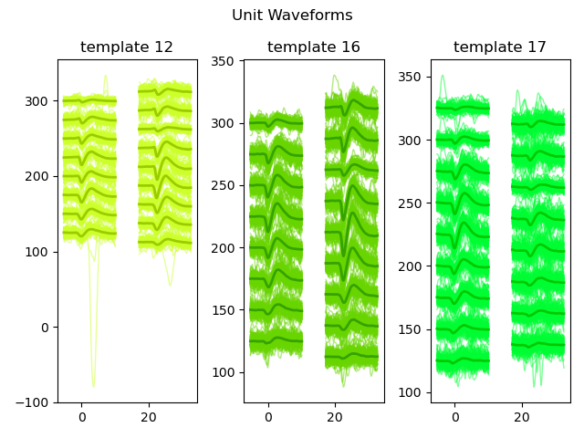
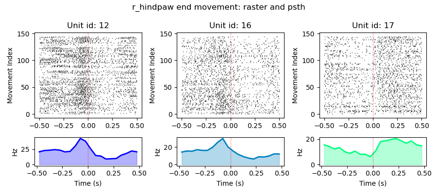
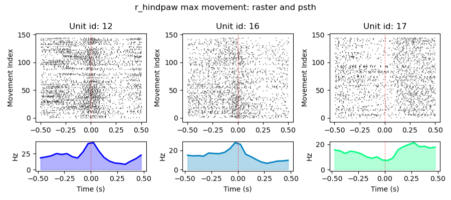

[](https://github.com/cjblack/neurokinematics/actions/workflows/session_class_test.yml)

 # neurokinematics

 ## Overview

 This repository provides a pipeline for processing and analysing electrophysiology (neuro) and markerless pose estimation (kinematics) data from behavioural neuroscience experiments.

 Tools included for
 * Spike sorting
 * LFP processing
 * Synchronising neural and behavioural recordings

 This code base is designed with the custom climbing behaviour in mind ([Naturalistic climbing reveals adaptive strategies for interlimb coordination in freely moving mice](https://doi.org/10.1016/j.isci.2026.115901)).

 ## Quick install
 Clone repository, and create environment:
 ```bash
git clone https://github.com/cjblack/neurokinematics.git
cd neurokinematics
conda env create -f environment_redux.yml
 ```

 For cuda capabilities (recommended if using this pacakge for spike sorting), use the following:
 ```bash
 conda env create -f environment_cuda.yml --solver=libmamba
 ```


## Usage

### [`pose`](https://github.com/cjblack/neurokinematics/tree/main/neurokinematics/pose)

### Process SLEAP files
```python
from neurokinematics.pose.preprocessing.base import process_sleap
pose = process_sleap(
    data_path = "path/to/sleap/h5/files",
    pose_cfg = "simple_pose_cfg.yaml",
    save_path = "path/to/save/directory # optional
)

print(pose.pose_output_path)
pose_df = pose.load_pose()
movement_df = pose.load_movement() # if enabled
```
This will
- Load and preprocess all .h5 SLEAP files in the `data_path` based on the config file.
- Save processed pose data to `pose_data.csv`.
- Optionally extract and save movement events to `movement_events.pkl` (if enabled in the config file).
- Returns a lightweight object to examine metadata and load processed pose and/or movement event (if enabled) results as a dataframe.

If `save_path` is not provided, outputs are written to `pose/` folder inside `data_path`.

### [`spikes`](https://github.com/cjblack/neurokinematics/tree/main/neurokinematics/ephys/spikes)
Currently tested with data acquired from Cambridge Neurotech H5 probe using the Open Ephys acquisition system, and spikesorting with kilosort4.

### Run spike sorting
This subpackage uses `spikeinterface` to perform spike sorting and some plotting. 

Spike sorting with neurokinematics requires the directory to an ephys recording and a [spike sorting config file](https://github.com/cjblack/neurokinematics/tree/main/configs/spk_sorting_cfg). The config will need to be updated and tested depending on your probe/acquisition system.

```python
from neurokinematics.ephys.spikes.sorting import sort

# Set data directory and param file
data_path = 'path/to/.oebin'
cfg_file = 'cfgfile.yaml' # located in 'configs/spike_cfg'
save_path = 'path/to/savefolder' # set to desired save location, default will store to data_path directory

# Sort spikes
sorting, recording, probe, analyzer = sort(data_path=data_path, cfg_file=cfg_file, save_path=save_path)
```

Data can then be viewed with phy2.

### Plotting spike waveforms
Neurokinematics can use the `spikeinterface` results stored during spike sorting for plotting.

```python
from neurokinematics.ephys.io import load_analyzer
from neurokinematics.ephys.spikes.plotting import plot_waveforms

# Load spikeinterface sorting analyzer
analyzer_path = 'path/to/analyzer/folder'
analyzer = load_analyzer(analyzer_path)

# Plot
plot_waveforms(
    analyzer = analyzer, 
    unit_ids = [12, 16, 17], 
    save_path = "path/to/outputs"
    )
```
This will
- First, load the saved `spikeinterface` analyzer object.
- Plot waveforms of selected unit ids across electrodes.
- Optionally save the plot as a `.png`.



### Extract and plot movement aligned spike rasters
This step requires a pre-computed movement alignment file (`movement_event_alignment.csv`).
```python
from neurokinematics.ephys.io import load_phy_sorting
from neurokinematics.ephys.spikes.rasters import get_movement_aligned_rasters

# Load sorter
phy_sorter_path = 'path/to/phy/output'
sorter = load_phy_sorting(phy_sorter_path)

# Plot spike aligned rasters
spike_rasters = get_movement_aligned_rasters(
    alignment = alignment_df, # pre computed movement alignment dataframe
    sorter = sorter,
    save_path = "path/to/outputs"
)
print(spike_rasters_obj.output_path)
spike_rasters_df = spike_rasters.load() # returns spike rasters as dataframe
```
This will
- Align spikes of units in the `sorter` object to movement times defined in the `alignment` dataframe.
- Save aligned rasters as `movement_aligned_rasters.pkl` to `save_path`.
- Return lightweight class to examine metadata and load aligned spikes as a dataframe.

This file can then be used for plotting the resulting spike rasters.

```python
from neurokinematics.io import load_pickle
from neurokinematics.ephys.spikes.plotting import plot_movement_psth

raster_df = load_pickle('path/to/movement_aligned_rasters.pkl')
unit_ids = [16, 17, 12]
movement_plot_params = 
    {  
    'node': 'r_hindpaw',
    'movement_event': 'end',
    'cmap': 'winter'
    'bin_size': 0.05
    }

plot_movement_psth(raster_df, unit_ids, movement_plot_params) # plot with respect to end of movement
movement_plot_params['movement_event'] = 'max'
plot_movement_psth(raster_df, unit_ids, movement_plot_params) # plot with respect to maximum velocity of movement
```
This will
- Create a combined spike raster and peri-stimulus time histogram for units aligned to movement events.
- Values set in `movement_plot_params` determine what node and movement event is plotted.
- Optionally save the plot as a `.png`.

 

### [`lfp`](https://github.com/cjblack/neurokinematics/tree/main/neurokinematics/ephys/lfp)
### Pre-process raw lfp data from OpenEphys

```python
from neurokinematics.ephys.lfp.preprocessing import preprocess_lfp

lfp_proc_obj = preprocess_lfp(
    data_path = "path/to/ephys", 
    node_idx = 0, # based on record node id
    rec_idx = 0, # based on recording folder id
    save_path = "path/to/outputs"
    ) 
lfp, metadata = lfp_proc_obj.load(return_metadata=True) # Load data and metadata
```
This will
- Load Open Ephys .continuous data (specified by `node_idx` and `rec_idx`).
- Chunk, downsample, and filter all channels.
- Store results in a zarr store (default) or memory map.
- Return lightweight class to examine metadata and load processed lfp data.

### Epoch lfp data with movement events
Align continuous lfp data to movements extracted from markerless pose estimation.
```python
from neurokinematics.ephys.lfp.epoch import get_movement_aligned_erps
from neurokinematics.io import load_csv
alignment_df = load_csv("path/to/movement_event_alignment.csv") # required
lfp_root = get_movement_aligned_erps(
    alignment = alignment_df,
    lfp_data = "path/to/zarr/store",
    save_path = "path/to/outputs",
    channel_select = [0,1,2,3,4] # set this according to the ephys channels you want to process
)
```
This will
- Align lfp data from specified channels from `channel_select` to ephys aligned events in `movement_event_alignment.csv`.
- Create a zarr store, saving associated metadata and subgroups as `node/movement_event`.
- Return the root zarr group as `lfp_root`.

### [`multi_modal`](https://github.com/cjblack/neurokinematics/tree/main/neurokinematics/multi_modal)

### Align video frames to ephys data using strobe method
If the camera's strobe ouput is fed to an analog input channel on the ephys acquisition system, the below method can identify the indices where frames were captured.
This has been tested only on FLIR blackfly S camera at 200fps using the Open Ephys acquisition system.

```python
from neurokinematics.multi_modal.alignment import get_camera_events

event_data, ts, bouts, frame_captures, continuous = get_camera_events(
    data_path = "path/to/ephys", 
    camera_cfg_file = "camera_alignment_cfg.yaml",
    save_path = "path/to/outputs"
    )
```
This will
- Identify frame captures times in ephys recording using the analog channel containing strobe data.
- Store resulting frame captures as `video_alignment.csv`.

### Align movement events to ephys
```python
from neurokinematics.multi_modal.alignment import align_movements_to_ephys
movement_alignment_df = align_movements_to_ephys(
    dirs = {
        "events": "path/to/events", # event path contains "movement_events.pkl" - required
        "pose": "path/to/pose", # pose path contains 'pose_data.csv' - required
        "alignment": "path/to/alignment" # alignment path contains 'video_alignment.csv' - required
    },
    save_path = "path/to/outputs"
)
```
This will
- Align previously extracted and stored movement event times to ephys indicies.
- Save resulting alignment as `movement_event_alignment.csv`.
- Return a dataframe containing the resulting alignments.

### [`data`](https://github.com/cjblack/neurokinematics/tree/main/neurokinematics/data)

#### Loading a session
This is for loading ephys and pose data together in one session object. You'll need to have relevant pose data stored in a `PoseData` folder within the folder containing your open ephys acquired data.

At the moment this is specific to the wall climbing video acquisition and analysis pipeline.
```python
from neurokinematics.data.session import ClimbingSession

data_path = 'path/to/ephys/data/folder'

csession = ClimbingSession(data_path)
```

## Scope and current support

This package has been developed and tested primarily on a specific experimental setup:
- SLEAP-based pose estimation
- Open Ephys acquisition system
- Cambridge Neurotech probes (specifically 64-channel H5 probes)

The core components are designed to be modular and extensible with the goal of supporting a wider range of data formats and recording systems.

At present, some assumptions about input structure (e.g. alignment data, config formats) reflect the original datasets used in development. These are documented in the relevant modules and can be adapted with minimal changes.

Future work will focus on generalising input interfaces and expanding format support including:
- Pose packages (e.g. DLC, Anipose)
- Ephys acquisition systems
- Probes (e.g. Neuropixels, Neuralynx)

## In development 
### [`workflows`](https://github.com/cjblack/neurokinematics/tree/main/workflows)
Experimental workflow ingests recording session into DataJoint pipeline. Currently handles registration and data structuring. Signal processing steps are not yet included.

Requires a `.env` file with database connection details.

#### Terminal example

```shell
python workflows.process_session "path/to/datafolder"
```

#### Python example
```python
from workflows.process_session import run
data_path = "path/to/datafolder"
run(data_path)
```