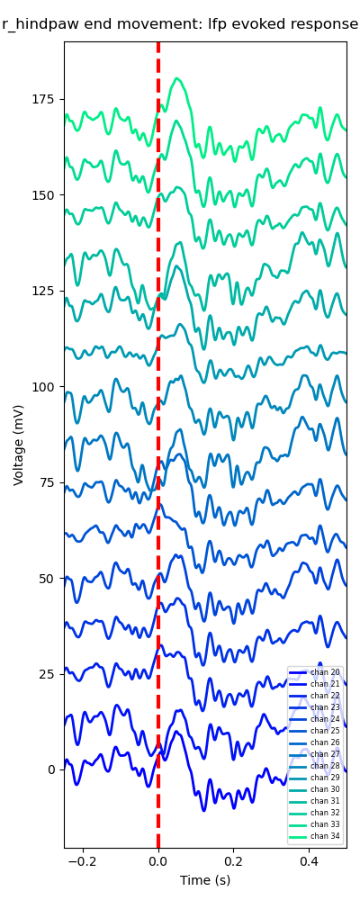

# lfp

The `lfp` module provides tools for preprocessing local field potential (LFP) data and extracting movement-related epochs for downstream analysis.

It is designed to standardise continuous electrophysiology data and align it with behavioural events derived from markerless pose estimation.


## Module structure
- `preprocessing.py` &rarr; core preprocessing pipeline for Open Ephys data
- `chunking.py` &rarr; utility for chunking LFP data during preprocessing
- `epochs.py` &rarr; alignment of LFP data to movement events
- `filters.py` &rarr; filtering functions used during preprocessing
- `plotting.py` &rarr; visualisation utilities for LFP data

## Pre-processing raw LFP data from Open Ephys

```python
from neurokinematics.ephys.lfp.preprocessing import preprocess_lfp

lfp_proc_obj = preprocess_lfp(
    data_path = "path/to/ephys", 
    node_idx = 0, # based on record node id
    rec_idx = 0, # based on recording folder id
    save_path = "path/to/outputs"
    ) 
lfp, metadata = lfp_proc_obj.load(return_metadata=True) # Load data and metadata
```
### What this does
- Loads Open Ephys `.continuous` data
- Chunks, downsamples, and filters all channels
- Stores results in a zarr store (default) or memory map

### Inputs
- Directory containing Open Ephys data
- Record node and recording indices
- Save path

### Outputs
- `lfp_preprocessed/` / `lfp_preprocessed.dat` &rarr; processed LFP data
- Lightweight object for accessing results 

## Epoch lfp data with movement events
Align continuous lfp data to movements extracted from markerless pose estimation.
```python
from neurokinematics.ephys.lfp.epochs import get_movement_aligned_erps
from neurokinematics.io import load_csv
alignment_df = load_csv("path/to/movement_event_alignment.csv") # required
lfp_root = get_movement_aligned_erps(
    alignment = alignment_df,
    lfp_data = "path/to/zarr/store", # alternatively, lfp_proc_obj.output_path if processing was just performed
    save_path = "path/to/outputs",
    channel_select = [0,1,2,3,4] # set this according to the ephys channels you want to process
)
```
### What this does
- Aligns LFP data to behavioural events in `movement_event_alignment.csv`.
- Stores epoched data in zarr store (`node/movement_event`).

### Inputs
- Dataframe containing alignment data
- Path to zarr store
- Save path
- Channel selection for epoching

### Outputs
- `node/movement_event` &rarr; zarr stores for each combination of nodes and movement events
- Lightweight object for accessing results

## Plot resulting erps
The resulting epoched data can then be used to plot grand averages across channels.
```python
from neurokinematics.ephys.lfp.plotting import plot_movement_erps_probe
plot_movement_erps_probe(
    epoch_path = "path/to/zarr/store",
    channels = [1, 2, 3],
    movement_plot_params = {
        'node' = 'node',
        'movement_event' = 'movement_event',
        'baseline_correct': True,
        'smooth': True,
        'xlims': (-0.25, 0.5),
        'cmap': 'winter'
    }
)
```
### Inputs
- Path to epoched data
- Channels to plot
- Parameters for plotting

### Outputs
- Plot of average evoked response across selected channels with respect to movement event

